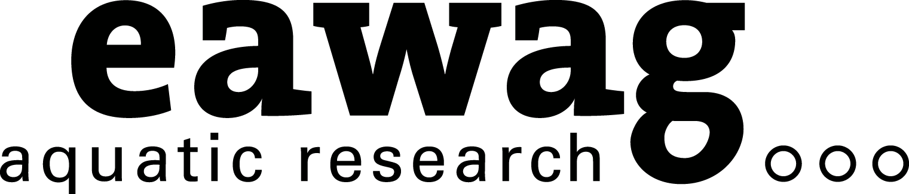

<!-- badges: start -->

<!-- badges: end -->

<h1> Black Soldier Fly Larvae Counting Machine </h1>

<b>Contributors</b>  
- Jonas Biner <a href="https://orcid.org/0009-0008-2161-3013">
 0009-0008-2161-3013
</a> *author, developer*  
- Jakub Tkaczuk <a href="https://orcid.org/0000-0001-7997-9423">
 0000-0001-7997-9423
</a> *supervisor, maintainer*  
- Christian Zurbrügg <a href="https://orcid.org/0000-0003-4980-4483">
 0000-0003-4980-4483
</a> *supervisor*  
- Stefan Diener <a href="https://orcid.org/0000-0002-6622-6980">
 0000-0002-6622-6980
</a> *supervisor*  
- Elizabeth Tilley <a href="https://orcid.org/0000-0002-2095-9724">
 0000-0002-2095-9724
</a> *supervisor*  

 

 

  

  
<b>Complete description of system design, functionalities, and operation is available on  
<a href="https://global-health-engineering.github.io/bsf-lcm/">Github pages</a>  
</b>  
It compliments the openly-accessible master's thesis, available on the  
<a href="">ETH Research Collection</a>

# Overview

# Licenses

The three core elements of this project are licensed under:

| Component      | License                                                                                                |
|----------------|--------------------------------------------------------------------------------------------------------|
| Hardware       | [CERN-OHL-S 2.0](https://opensource.org/license/cern-ohl-s)                                            |
| Software       | [Apache 2.0](https://opensource.org/license/apache-2-0)                                                |
| Documentation  | [Creative Commons Attribution 4.0 International](https://creativecommons.org/licenses/by/4.0/)         |